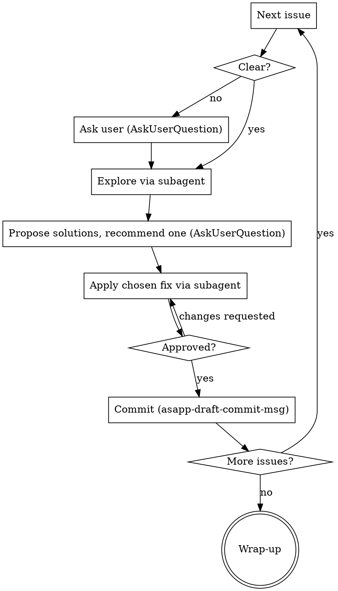

# Resolve Review Issues

Work through the review issues beneath a `TODO.md` task. For each issue, in order: explore → propose → apply → commit.

**Core principle:** this skill *resolves issues you identified* — it does not hunt for new ones. It works
**strictly one issue at a time**, **never modifies a file before you approve the fix**, and treats each
resolved issue as **its own commit**. Exploration and fixes are **delegated to subagents** to keep the
main context clean.

## Usage

- `/asapp-resolve-review-issues <line-number>` — resolve issues under the task at that line of `TODO.md`
- `/asapp-resolve-review-issues <quoted or named task>` — locate the matching task, then resolve its issues
- `/asapp-resolve-review-issues` (no argument) — ask which task

## Process

### Step 1: Locate and gather context

Do all of this up front. Do not solution anything yet.

1. **Resolve the task** — turn the input (line number, or quoted/named text) into a single `TODO.md` entry.
2. **Enumerate the issues** — issues are plain `*` bullets nested one level under the subtask they concern:

   ```markdown
   * <main task>
       * [ ] <subtask under review>
           * <issue 1>
           * <issue 2>
   ```

   List them in order. Do **not** analyze them yet.
3. **Auto-discover supporting context** (note paths only — do not open the files yet):
   - **Spec** — `docs/superpowers/specs/YYYY-MM-DD-<slug>-design.md` matched to the task slug.
   - **Plan** — `docs/superpowers/plans/YYYY-MM-DD-<slug>.md` matched to the task slug (may not exist).
   - **Commit range** — from `git log`, the contiguous block of recent commits implementing the task. Propose `<first>..<last>`.
4. **Confirm only if in doubt** — if the task, issue list, spec/plan, and commit range are unambiguous, state your read in one line and go straight to Step 2.

### Step 2: Per-issue loop (go one by one)

Process issues **strictly in order, one at a time**. Do not analyze or propose solutions for later issues until the current one is committed.



For the current issue:

- **a. Understand** — read it; state its intent and purpose in one or two lines. If genuinely unclear, **stop and ask** (`AskUserQuestion`) before exploring.
- **b. Explore (delegate)** — dispatch a subagent to investigate the involved code, the relevant commits from the range, and **only the relevant slice** of the spec/plan. Pick the most specific agent. It returns a concise findings report — not file dumps.
- **c. Propose** — from the findings, propose one or several solutions **with a recommended one**, via `AskUserQuestion`. Name the trade-offs briefly.
- **d. Wait** — wait for the user's choice. **Do not modify any file before this.**
- **e. Apply** — how you apply depends on whether the fix changes runtime behavior:
  - **Behavioral fix** (bug fix, logic change, new validation or edge case): **drive `superpowers:test-driven-development` from the main context** — it owns the RED→GREEN→refactor loop and its checkpoints. The TDD skill delegates the small concrete steps — authoring the failing test, then the production fix — to the most specific specialist subagent.
  - **Non-behavioral fix** (docs, comments, formatting, config without logic, pure rename): dispatch the most specific specialist subagent to apply the change directly.
  - Always follow `.claude/rules/`.
  - Use IntelliJ MCP for IDE-grade operations (safe rename refactor, reformat, inspections) when appropriate.
- **f. Review & approve** — show the user what changed (diff/summary). Wait for approval. If changes are requested, iterate (back to **e**) before committing.
- **g. Commit** — build the message with the `asapp-draft-commit-msg` skill, then commit **only this issue's changes**. One issue = one commit. Then remove the resolved issue bullet from `TODO.md`.
- **h. Continue** — move to the next issue. Repeat until none remain.

### Step 3: Wrap-up

- Summarize what was resolved: issue → commit, in order.
- **Do not** mark the parent task complete or merge — closing the task (merge to main, etc.) is the user's manual step.

## Delegation & tools — quick reference

| Situation | Use |
|-----------|-----|
| Locate / understand code for an issue | `Explore`, or `code-reviewer` / `architect-reviewer` |
| Apply a production-code fix | `spring-boot-developer` |
| Add or adjust tests | `test-automator` |
| CI / Docker / observability fix | `devops-engineer` |
| README / changelog / docs fix | `documentation-engineer` |
| Agent / rule / skill (`.claude/`) fix | `claude-docs-maintainer` |
| Safe rename, reformat, inspections | IntelliJ MCP |
| Build the commit message | `asapp-draft-commit-msg` skill |
| A fix triggers a test failure or bug | `superpowers:systematic-debugging` |

Pick the **most specific** agent from `.claude/agents/`; `general-purpose` is a last resort.

## Hard rules

- **Never modify a file until the user approves the chosen solution** for the current issue.
- **One issue at a time** — Step 1 only *enumerates* the issues; never analyze or propose solutions for all of them up front.
- **Never fully read the spec or plan** — load only the slice an issue needs, via the exploration subagent.
- **Keep the main context clean** — delegate exploration and fix authoring to subagents; the main context orchestrates.
- **One issue → one commit**, message built with `asapp-draft-commit-msg`.
- **Do not close the parent task or merge** — that is the user's manual step.

## Common mistakes

| Mistake | Fix |
|---------|-----|
| Analyzing or proposing solutions for all issues at the start | Enumerate only in Step 1; solution one issue at a time. |
| Editing code before the user picks a solution | Propose first; apply only after approval. |
| Skipping the single up-front confirmation | Confirm task, issue list, spec/plan, and commit range once before starting. |
